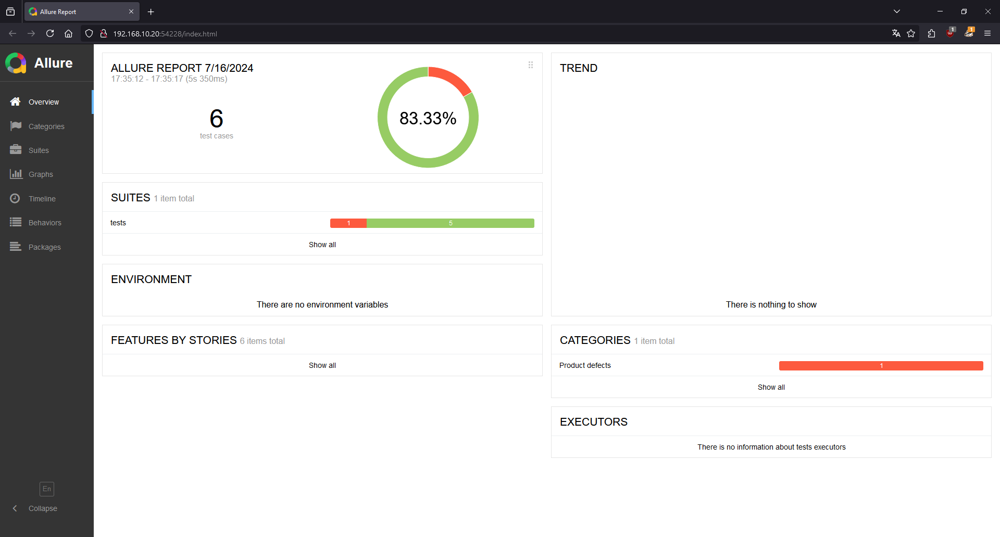
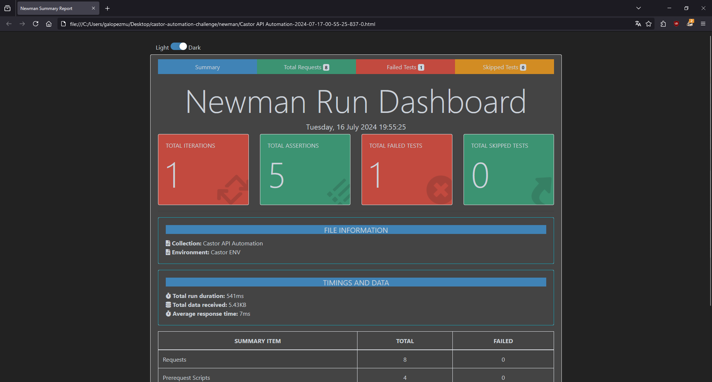
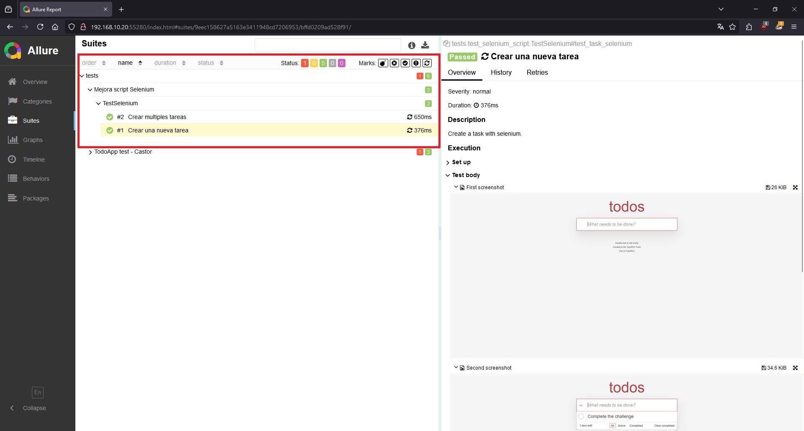

# Evaluación QA Automatizador - Castor

- Los siguientes son los criterios de evaluación que se tendrán en cuenta durante
la prueba técnica para aplicar como QA Automatizador en Castor:
    - Precisión: Respuestas acotadas, concretas y claras.
    - Fundamentación: Entendimiento de lo que se habla. Ser coherentes y consecuentes en
todo el proceso de la prueba con argumentos que sustenten cada respuesta.
    - Calidad: Cumplir con los criterios de aceptación de cada prueba. Entregar lo que se
solicita de la mejor forma posible.
    - Creatividad: La originalidad, formas nuevas y enfoques distintos en la presentación de
lo solicitado se apreciará en la valoración final.
    - Oportunidad: Entregar en el tiempo convenido. Trabajar dentro de un
time-box es muy
importante cuando hablamos de principios ágiles.

## Solución parte 1

Para la solución  de la primera parte, se usó como base la aplicacion https://todomvc.com/examples/react/dist/, ya que en la prueba no fue proporcionada una aplicación válida.

La PoC de las prueba fue realizada utilizando las siguientes librerías de python:
- playwright: Utilizada para la interacción de todo los elementos web
- pytest: Framework para poder crear los casos de prueba
- hamcrest: Framework para realzar las aserciones
- allure: Framework para la parte de reporteria

Además, la PoC cuenta con el patrón de diseño POM.

### Requisitos para la ejecución de las pruebas

1. Tener instalado python (La PoC se desarrolló con python 3.12.4)
2. Tener instalado JDK >= 17 (para poder usar allure)
3. Instalar scoop

   ```powershell
    Set-ExecutionPolicy -ExecutionPolicy RemoteSigned -Scope CurrentUser
    Invoke-RestMethod -Uri https://get.scoop.sh | Invoke-Expression
   ```
4. Instalar allure
   
   ```powershell
    scoop install allure
   ```
5. Instalar las dependencias de python
   
   ```powershell
   pip install -r requirements.txt
   ```
### Ejecución de las pruebas
1. Ejecutar el comando pytest sin argumentos, ya que toda la configuración necesaria estará en el archivo ***pytest.ini***
2. Luego de la ejecución, ejecutar el comando ***allure serve***, este abrirá una pestaña en el navegador con el resultado de las pruebas ejecutadas



## Solución parte 2

Para la solución de la segunda parte, se realizó la automatización en Postman, además, se uso la herramienta json-server, ya que en la prueba no fue proporcionada una aplicación válida.

La prueba se realizó con las siguientes librerías de nodejs:

- newman: Usado para la ejecución de los casos de prueba de postman
- newman-reporter-htmlextra: Usado para la generación del reporte de las pruebas.
- 
### Requisitos para la ejecución de las pruebas

1. Tener instalado nodejs
2. Instalar newman
   
   ```powershell
   npm i -g newman
   ```
3. Instalar newman-reporter-htmlextra
   
   ```powershell
   npm i newman-reporter-htmlextra
   ```
### Ejecución de las pruebas

1. Arrancar el mock API con el comando
   
   ```powershell
   npx json-server --watch db.json
   ```
2. Ejecutar las pruebas con el comando
   ```powerhsell
   newman run Castor_API_Automation.postman_collection.json -e Castor_ENV.postman_environment.json -r htmlextra
   ```
3. Luego de la ejecución, abrir la carpeta ***newman***, y abrir el reporte generado



## Solución parte 3

Para la solución de la tercera parte, se reutilizaron las librerías de la parte 1, exceptuando playwright, ya que el script hace uso de Selenium.

### Cambios realizados

Los cambios realizados se listan a continuación:

- Se modificó el script para que este hiciera parte de una testsuite de pytest
- Se creó un fixture para poder darle manejo al webdriver
- Se crearon las esperas explicitas para los elementos de la aplicación web
- Se añade un test dónde se crean multiples tareas
- Se crean dos métodos para la creación de tareas y para traer las tareas creadas
- Se añade la reportería, se hace uso de allure
  
### Ejecución de las pruebas
1. Ejecutar el comando pytest sin argumentos, ya que toda la configuración necesaria estará en el archivo ***pytest.ini***
2. Luego de la ejecución, ejecutar el comando ***allure serve***, este abrirá una pestaña en el navegador con el resultado de las pruebas ejecutadas

